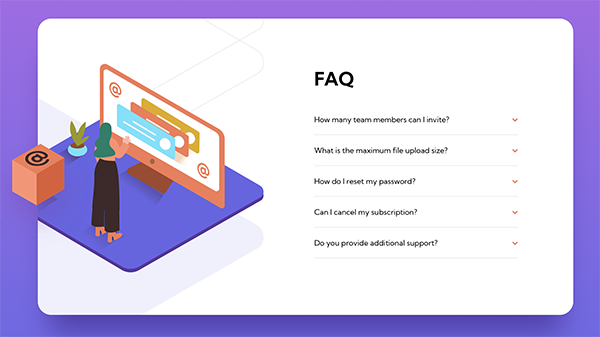

# Frontend Mentor - FAQ accordion card solution

This is a solution to the [FAQ accordion card challenge on Frontend Mentor](https://www.frontendmentor.io/challenges/faq-accordion-card-XlyjD0Oam). Frontend Mentor challenges help you improve your coding skills by building realistic projects.

## Table of contents

  - [Overview](#overview)
    - [The challenge](#the-challenge)
    - [Screenshot](#screenshot)
    - [Links](#links)
  - [My process](#my-process)
    - [Built with](#built-with)
    - [What I learned](#what-i-learned)
  - [Author](#author)

## Overview

### The challenge

Users should be able to:

- View the optimal layout for the component depending on their device's screen size
- See hover states for all interactive elements on the page
- Hide/Show the answer to a question when the question is clicked

### Screenshot

### Links

- Solution URL: [view on Frontend Mentor website](https://www.frontendmentor.io/solutions/responsive-faq-component-using-flexbox-and-relative-positioning-rk71puZEc)
- Live Site URL: [https://faq-accordion-card-candyfair.vercel.app](https://faq-accordion-card-candyfair.vercel.app)

## My process

This solution was developed for mobiles first. I set up a SASS environment with variables and coded for mobile and tablet layouts first. I then added a media query and styled the website for desktops.

### Built with

- HTML
- SASS/SCSS
- Flexbox
- Mobile-first workflow

### What I learned

I really struggled to position the images for the desktop layout. I understood it was easier to resize them if they were wrapped in a div, and I also used this  trick to get one of the images out of the `overflow: hidden` workflow: I positioned the image outside of the `<main>` section that had a hidden overflow property, but kept it within a wrapper so it wouldn't drastically change position in case the window would be resized.

## Author

- Frontend Mentor - [@Candyfair](https://www.frontendmentor.io/profile/Candyfair)
- Twitter - [@candy_fair](https://www.twitter.com/candy_fair)
